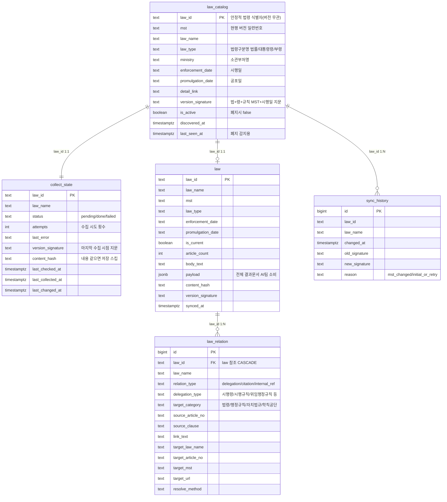

# DB 스키마 (ERD) — `lawdb`

법령 수집 파이프라인이 쓰는 Postgres(`lawdb`) 5개 테이블의 전체 컬럼·관계.
모든 키는 `law_id`(법령 고유 식별자, 버전 무관) 기준으로 연결된다.

## 테이블 역할

| 테이블 | 역할 | 채우는 곳 |
|---|---|---|
| **law_catalog** | 전체 현행법령 명단 "무엇이 존재하나" + 변경감지 기준 지문 | `discover` |
| **collect_state** | 법령별 처리 상태·재처리 (status·attempts·error·지문·내용해시) | `collect`(수집 시) |
| **law** | 수집 결과 본체 — `payload`(JSONB) 통째 + 자주 쓰는 조회용 컬럼 | `collect` |
| **law_relation** | `payload.relations` 를 행으로 펼친 **쿼리용 사본** (SQL 조회 편의) | `collect` |
| **sync_history** | 지문 변경 이력 (감사용) | `sync`(변경 감지 시) |

## 관계·설계 메모

- **`law_catalog` 1:1 `collect_state`** — discover 가 목록을 채우면 신규 법령은 `collect_state`에 `pending`으로 등록. catalog 의 최신 지문 vs collect_state 의 마지막 수집 지문을 비교해 재수집 여부 결정.
- **`law_catalog` 1:1 `law`** — 수집이 끝나면 `law`에 payload 저장(아직 수집 전이면 `law` 행 없음 → `o|`).
- **`law` 1:N `law_relation`** — payload 안 relations 를 정규화해 담은 사본. `ON DELETE CASCADE` 라 law 삭제 시 함께 정리. **AI팀은 `law.payload` 하나면 충분**하고, 이 테이블은 SQL 조회 편의용(선택).
- **폐지** — `discover` 가 전체 목록을 받을 때 안 보인 법령은 `is_active=false`(soft delete, 데이터는 보존).
- **조례(`ordinance_delegations`)** — 한 조문에 수백 건이라 정규화하지 않고 `law.payload` JSONB 안에만 보존.
