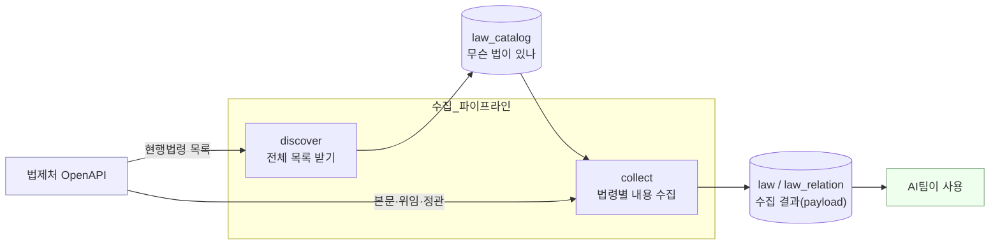
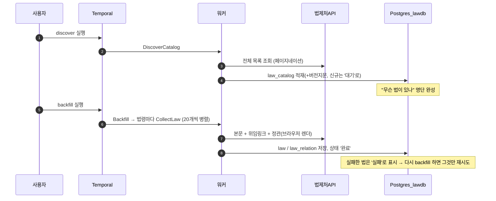
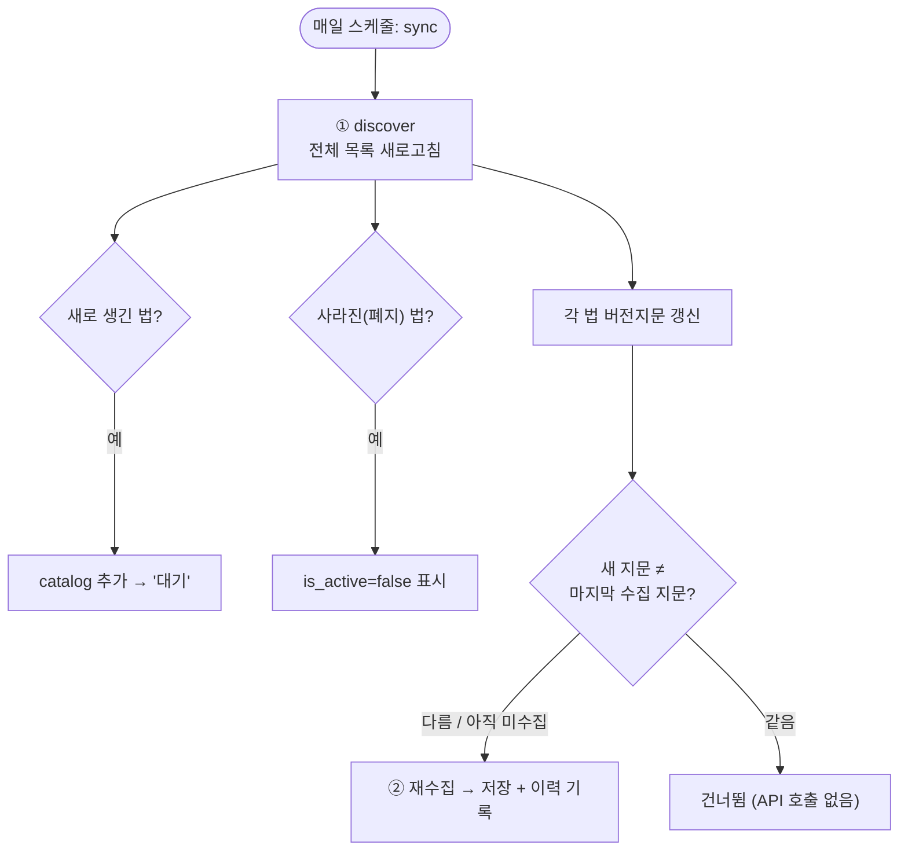
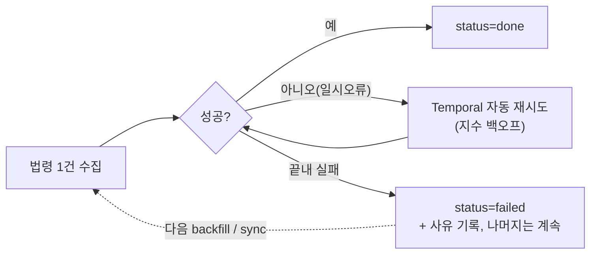

# 법령 수집·적재 시스템 — 단계별 흐름 (보고용)

> 한 줄 요약: **법제처의 현행 법령을 전부 받아, 본문 + 본문 속 모든 하이퍼링크(다른 법·시행령·행정규칙·조례·정관)를 메타데이터로 정리해 DB에 쌓고, 매일 바뀐 것만 자동 갱신**하는 시스템.

문서 3종:
- **이 문서(OVERVIEW)** — 전체가 어떻게 도는지 단계별 그림
- **[COLLECTION.md](COLLECTION.md)** — 본문·하이퍼링크를 어떻게 뽑나 + payload(결과) 형식
- **[PIPELINE.md](PIPELINE.md)** — Temporal 자동화 + DB 스키마 + 실행

---

## 1. 무엇을 하나 (큰 그림)

| 용어 | 뜻 |
|---|---|
| **목록(catalog)** | "어떤 법이 존재하나" 명단. `discover` 가 채움. |
| **수집(collect)** | 한 법령의 본문 + 하이퍼링크를 받아 정리(payload). |
| **지문(signature)** | 법률 + 시행령 + 시행규칙의 버전번호(MST)를 묶은 짧은 해시. **이 값이 바뀌면 = 개정됨.** |

---

## 2. 초기 적재 (처음 한 번)

> "명단 만들기 → 명단 보고 하나씩 수집"

1. `discover` — 현행 **법률 명단(약 1,700건)** 을 통째로 받아 `law_catalog` 에 저장. 각 법의 **버전지문**도 같이 계산.
2. `backfill` — 명단에서 **아직 안 한 법** 을 골라 본문·하이퍼링크를 수집해 저장(20개씩 병렬).
3. 일부 실패해도 **나머지는 계속**, 실패분은 `failed` 로 남아 **다음 `backfill` 때 자동 재시도**.

---

## 3. 이후 매일 자동 (변경 감지 = sync)

> "매일 명단 새로고침 → 바뀐 법만 다시 수집"

- **새 법**이 생기면 명단에 추가하고 수집,
- **폐지된 법**은 `is_active=false` 로 표시(데이터는 보존),
- 기존 법은 **지문만 비교**해서 **바뀐 것만** 다시 수집(안 바뀐 건 그대로).

> 변경 감지는 본문을 매번 받아 비교하는 게 아니라 **버전번호(MST) 지문 비교**라 가볍다.

**버전지문(`version_signature`) 만드는 법**
- 전체 목록(`lawSearch`)엔 시행령·시행규칙도 **각각 별도 행**으로 나옴 → 이름으로 묶어 **「본 법 + 시행령 + 시행규칙」의 MST 3개**를 모음.
- 그 3개를 정렬·직렬화해 **SHA-256 앞 16자**로 압축 = 지문.
  - 예) 장애인복지법(279697) + 시행령(281165) + 시행규칙(282417) → `0014023d6e007816`
- **셋 중 하나라도 MST가 바뀌면**(= 본법/시행령/시행규칙 개정) 지문이 달라짐 → 그 법만 재수집. (시행령·규칙 개정으로 위임 대상이 바뀌는 것도 이렇게 잡음)

---

## 4. 실패·과호출에 강하게 (재처리)

- **단일 실행 내**: 네트워크 등 일시 오류는 Temporal 이 자동 재시도.
- **실행 간**: 끝내 실패하면 `failed` 로 남고, **다음 `backfill`/`sync` 가 그것만 다시 시도**(`attempts` 로 횟수 추적).
- 호출 간 0.2초 간격 + 배치(20) 동시성 제한으로 **과호출 방지**.

---

## 5. 데이터는 어디에 / 무엇을 주나

- **DB 스키마(테이블·필드별 의미)** → [PIPELINE.md](PIPELINE.md#5-db-스키마-lawdb)
- **결과 payload(필드별 의미)** → [COLLECTION.md](COLLECTION.md)
- **AI팀 핸드오프**: `law.payload`(JSONB) 하나면 충분(본문·relations·조례·메타 포함). `law_relation` 테이블은 SQL 쿼리 편의용 사본(필수 아님).

---

## 6. 한계 / 주의점

### 6-1. 타겟별 "버전 추적이 되느냐"가 다르다
변경 감지의 핵심은 **"가볍게 전체 목록을 받아 MST 를 비교"** 인데, 타겟마다 그 목록이 있느냐가 갈린다.

| 대상 | 전체 목록 한 방? | 버전 추적 |
|---|---|---|
| 본 법 + 시행령 + 시행규칙 | ✅ `lawSearch` 에 다 나옴 | ✅ **catalog 지문(MST 3개)으로 추적** |
| 인용 대상(형법·민법 등 = 법률) | ✅ `lawSearch` 에 나옴 | ✅ **catalog 가 자동 추적** (아래 6-2) |
| **조례(자치법규)** | ❌ 법령 목록에 없음(별도·수만 건) | ⚠️ **독립 추적 어려움** → 부모 법 통해서만 |
| **정관(학칙공단)** | ❌ 목록 API 자체가 없음 | ⚠️ **독립 추적 어려움** → 부모 법 통해서만 |

### 6-2. 인용 대상(외부 법률)
- 인용 URL(`법령/형법/제250조`)은 **제목 기반 = 항상 최신 버전**을 가리킴 → 형법이 개정돼도 **링크는 그대로 유효**(우리가 형법 내용을 저장하지 않으니 재수집 불필요).
- 형법이 **폐지·개명**되면 그건 **catalog(법률 전체)에 잡힘** → `discover` 가 감지 가능. (`target_mst` 도 catalog 조인으로 채울 수 있음 — 미적용)

### 6-3. 조례·정관
- **`version_signature` 는 법+시행령+시행규칙 MST 만**(SHA-256 앞 16자) 추적. **조례·정관은 지문에 안 들어감.**
- 조례/정관은 **"가볍게 diff 할 전체 목록"이 없어서**(조례=별도 수만 건, 정관=목록 API 없음), 우리는 **오직 "부모 법의 위임정보(lsDelegated/렌더)"를 통해서만** 알게 됨.
- 결과: **부모 법(법/령/규칙)이 안 바뀌면**, 그 법이 위임한 **조례·정관이 단독으로 추가·삭제·제목변경돼도 sync 가 감지 못 함.**
  - 단, 우리가 저장하는 건 *내용*이 아니라 **제목+링크**라 → 대상의 *내용* 변경은 무관(링크가 최신 가리킴). **실제 문제는 "제목 변경 / 추가·삭제"뿐.**
- **링크 취약점**: 조례/정관 URL 은 **제목 기반**(`자치법규/{제목}`, `학칙공단/{제목}`) → 제목이 바뀌면 URL 이 깨질 수 있음.

**보완 방법(현재 A만 적용):**
| | 방법 | 비용 |
|---|---|---|
| A (적용) | **부모 기준** — 부모 법 MST 변경 시 lsDelegated/렌더 재수집 → 조례/정관 갱신 | 단독 변경은 놓침 |
| B (대안1) | **조례·정관 보유 법만 주기(주/월) 강제 재수집** — 부모 MST 안 바뀌어도 | 그 법 수에 비례(일부라 감당 가능) |
| C (대안2) | 조례 일련번호로 개별 현재상태 확인 | 조례 수만큼 호출(무겁고, 정관엔 API 없어 불가) |

### 6-4. 기타
- **정관은 브라우저(Chrome) 필수** — JS 렌더 페이지에서만 나옴. Selenium/Playwright 도 결국 브라우저 필요. 브라우저 없으면 정관만 누락.
- **인용/자기참조는 텍스트 휴리스틱**(같은 법·괄호·절경계 보정) — 드물게 오귀속 가능. 본문에 트리거 문구만 있고 등록문서 0건인 **빈 위임링크**는 제외.

---
