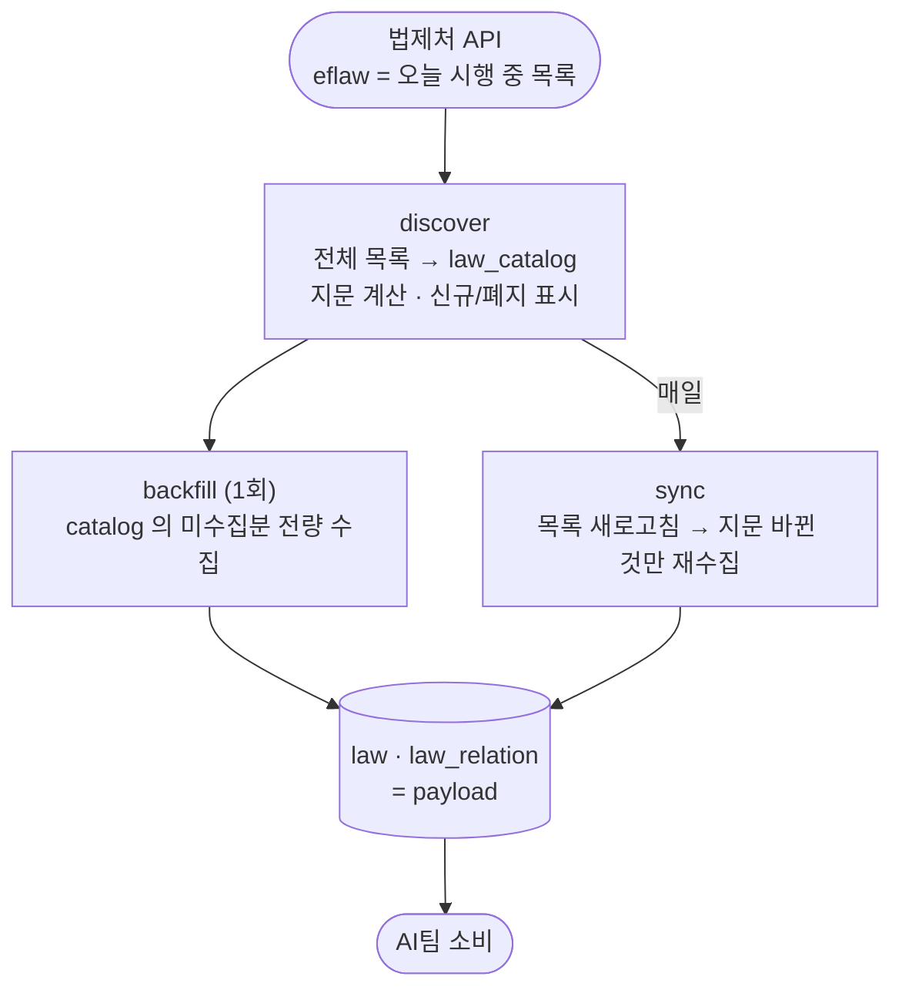
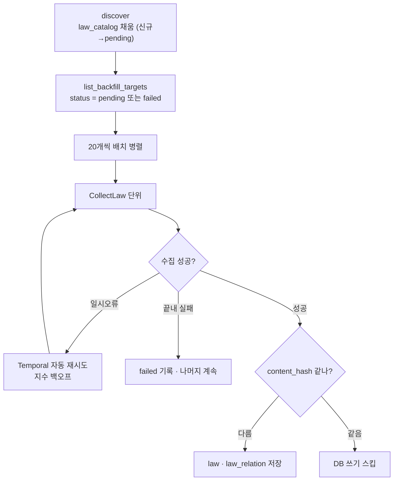
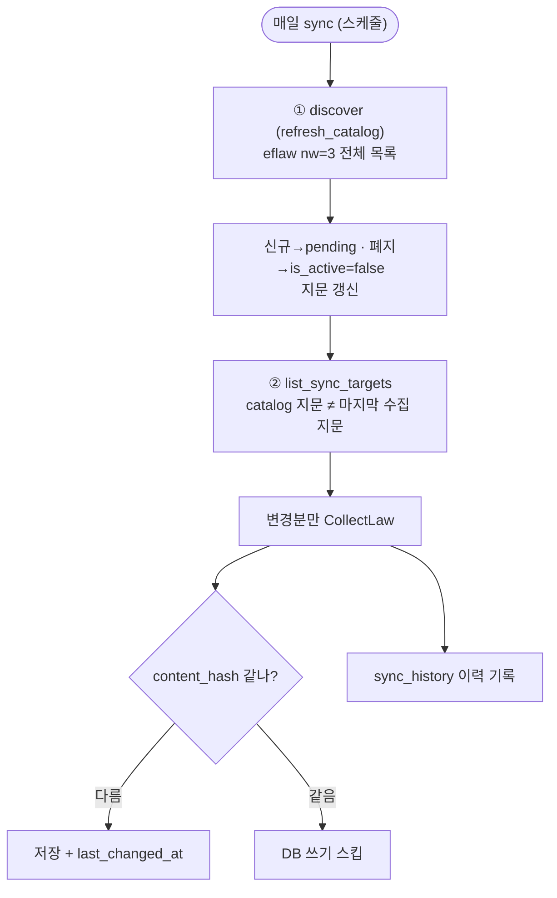

# 적재 파이프라인 (운영)

법제처 현행 시행 법령을 **discover(목록) → backfill(초기 전량) → sync(매일 변경분)** 3단계로 자동 수집·적재한다. 결과는 전용 **Postgres `lawdb`** 에 쌓이고 AI팀이 DB 로 소비 OR JSON 파일 제공

> 수집 로직(본문·하이퍼링크를 어떻게 뽑나) → [COLLECTION.md](COLLECTION.md) · DB 테이블·컬럼 → [ERD.md](ERD.md) · 실행/환경변수 → [README](../README.md)

---

## 1. 큰 그림

- **discover** 가 "무슨 법이 있나"(catalog)를 채우고 각 법의 변경감지 **지문**을 계산한다.
- **backfill** 은 그 catalog 를 보고 아직 안 받은 법을 전량 수집(처음 한 번).
- **sync** 는 매일 discover 를 다시 돌려 **지문이 바뀐 법만** 재수집한다.

---

## 2. 워크플로 (4개)

| 워크플로 | 언제 | 하는 일 |
|---|---|---|
| **DiscoverCatalogWorkflow** | `discover` / `sync` 앞단 | 전체 목록(`eflaw nw=3`) 조회 → `law_catalog` 적재 (신규 `pending`·폐지 `is_active=false`·지문 갱신) |
| **CollectLawWorkflow**(name, id, sig) | backfill·sync 내부 **공용 단위** | 한 법령 [수집→저장] (멱등, 재시도·`content_hash` 스킵 포함) |
| **BackfillWorkflow**([N]) | 초기적재 / 재처리 | catalog 의 `pending`·`failed` 를 배치로 CollectLaw |
| **SyncWorkflow**() | 매일 스케줄 | discover → 지문 바뀐 것만 CollectLaw → 이력 기록 |

> 워크플로는 **결정적 오케스트레이션만** 담당하고, 실제 I/O(네트워크·Chrome·DB)는 전부 **activity** 로 격리해 워커의 스레드풀에서 실행한다. 수집 후엔 공통으로 **검증·알림**(#5)이 붙는다.

---

## 3. 초기적재 — `discover` + `backfill`

"명단 만들기(discover) → 명단에서 안 끝난 것만 배치로 수집(backfill) → 실패는 격리하고 이어받기"

**재처리(이어받기)가 강한 이유**
- **자동 재시도**: 네트워크/일시 오류는 activity `RetryPolicy` 가 지수 백오프로 재시도. API 호출도 자체 백오프(4xx는 재시도 안 함).
- **빈 데이터 방지**: 검색/본문이 비면 `CollectError` 로 명확히 실패 → 빈 payload 가 `done` 으로 굳지 않음.
- **실패 격리**: 한 법령이 끝내 실패해도 `status='failed'` 기록 후 **나머지는 계속**.
- **이어받기**: `backfill` 은 `pending`·`failed` 만 대상. 다시 돌리면 **안 끝난 것만** 재처리(`attempts` 로 횟수 추적).
- **배치·간격**: `LAW_BACKFILL_BATCH`(기본 20) 병렬 + 호출 간 0.2s → 과호출/히스토리 제어.

---

## 4. 매일 동기 — `sync`

"목록 새로고침(discover) → 지문 바뀐 것만 재수집 → 이력 기록"

### 변경 감지는 2단 게이트 — 1단 "재수집할지", 2단 "DB에 쓸지"

1. **`version_signature`** (목록 비교 · 가벼움): 법+시행령+시행규칙의 **(MST + 시행일)** 해시. catalog 최신 지문 ≠ 마지막 수집 지문이면 재수집. (전체 sweep ≈ 56콜, 본문 재수집은 바뀐 법만)
   - **왜 시행일까지?** *공포* 는 MST 변경으로 잡히지만, 이미 공포된 개정의 *시행 도래*(같은 MST, 시행일만 advance)는 MST 만으론 못 잡는다. eflaw 현행 시행일이 그 전환 때 advance → 시행일까지 넣어야 감지된다.
2. **`content_hash`** (내용 비교 · 재수집 후): payload 내용 해시가 이전과 **같으면 `law` 쓰기 스킵**(지문은 바뀌었지만 내용은 그대로) → 확인시각만 갱신.

### 지문과 무관하게 자동 처리
- **폐지** — 전체 목록에 안 보이면 `last_seen_at` 미갱신 → `is_active=false`(soft delete, 데이터 보존).
- **시행령/규칙 단독 변경** — 부모 법률 지문에 (령·규칙 MST·시행일이) 포함 → 부모 법률 재수집 → 위임 링크 자동 갱신.

---

## 5. 수집 후 — 검증 · 알림 (공통)

### 커버리지 검증 (`verify_run`)
수집한 payload 가 본문 하이퍼링크를 다 담았는지 **Chrome ground-truth 와 대조**. 초기적재/동기가 **다른 옵션**을 쓴다(env, 최선 노력 — 실패해도 워크플로를 막지 않음):

| env | 시점 | 값 (기본) |
|---|---|---|
| `LAW_VERIFY_BACKFILL` | 초기적재 후 | `off` / `random:N` / `all` (기본 `random:3` 표본) |
| `LAW_VERIFY_SYNC` | 동기 후 | `off` / `changed` / `all` (기본 `changed` = 이번에 바뀐 것 전부) |

독립 실행(수동 검증)도 가능 — 명령은 [README](../README.md#실행).

### 완료 알림 (`notify`)
`backfill`/`sync` 끝나면 대상/완료/실패/신규/폐지 + 검증 요약을 **Slack**(웹훅 설정 시) 또는 **macOS 데스크톱**으로. 미설정이면 조용히 패스.

---

## 6. 운영 한계

변경 감지는 "가볍게 전체 목록을 받아 지문 비교"에 기대는데, **대상마다 그 목록이 있느냐**가 갈린다.

| 대상 | 전체 목록 | 버전 추적 |
|---|---|---|
| 본 법 + 시행령 + 시행규칙 | ✅ 목록에 다 나옴 | ✅ catalog 지문(MST+시행일)으로 추적 |
| 인용 대상(형법·민법 등 법률) | ✅ 목록에 나옴 | ✅ catalog 가 폐지·개명을 감지 |
| **조례(자치법규)** | ❌ 별도·수만 건 | ⚠️ **부모 법 통해서만** |
| **정관(학칙공단)** | ❌ 목록 API 없음 | ⚠️ **부모 법 통해서만** |

- **조례·정관은 `version_signature` 에 안 들어간다.** 부모 법(법/령/규칙)이 안 바뀌면, 그 법이 위임한 조례·정관이 **단독으로 추가·삭제·제목변경돼도 sync 가 못 잡는다.**
  - 단, 우리가 저장하는 건 *내용* 이 아니라 **제목+링크** 라 대상의 *내용* 변경은 무관(링크가 최신 가리킴). 실제 문제는 "제목 변경 / 추가·삭제"뿐.
- **보완책(현재 A):** ⒜ 부모 MST 변경 시 재수집(적용) / ⒝ 조례·정관 보유 법만 주기적 강제 재수집(미적용) / ⒞ 조례 일련번호로 개별 확인(무겁고 정관엔 API 없음).
